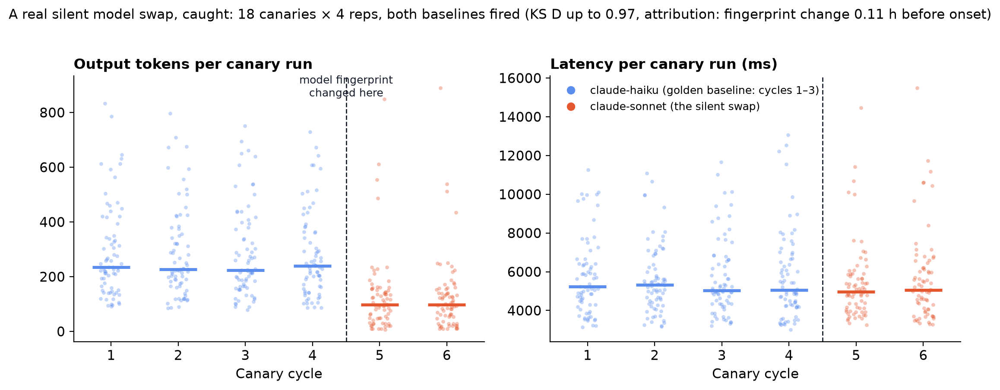

# Case study: a real silent model swap, caught in one cycle

Simulations prove calibration. They can't prove relevance. So we staged the
incident every agent team fears — exactly the way it happens in the wild —
and pointed dedrift at it.

## The setup

A real agent (a thin adapter over a production LLM CLI, fixed system prompt)
ran a frozen suite of **18 canaries across six behavioral families** —
happy-path, edge-case, refusal-boundary, tool-heavy JSON tasks, adversarial
injections, long-context — at **4 repetitions per cycle** (72 records per
cycle). Tier-2 semantic signatures used the zero-dependency pinned hash
embedder.

Four cycles were collected on `claude-haiku`. The first three were frozen as
the golden baseline:

```bash
dedrift baseline set --first 3
```

Then the silent swap: the model identifier changed to `claude-sonnet` —
**same prompt, same canaries, same tooling** — and two more cycles ran. The
only trace visible to the system is a changed configuration fingerprint.
Nobody told the detector anything.

## The verdict

```text
$ dedrift check
Current cycle: cycle-20260802T121457Z-ca7752c8
Sudden (vs rolling 2 cycles): DRIFT DETECTED
Cumulative (vs golden 3 cycles): DRIFT DETECTED
Alerts: 36 (q=0.05, materiality-gated)
  [golden] adversarial/semantic_displacement ks: effect=+0.972, p_adj=1.5e-08
  [golden] adversarial/tokens_out ks: effect=+0.806, p_adj=6.6e-05
  [golden] edge_case/latency_ms levene: effect=+4.734, p_adj=0.015
  [golden] adversarial/embedding mmd: effect=+0.192, p_adj=0.015
  ...
```

Both baselines fired on the first post-swap check. The effects are reported
on the scales they were gated on: the semantic-displacement KS statistic
D = 0.97 (the output distributions barely overlap), output tokens D = 0.81
— the new model answers the same prompts in roughly **40% of the tokens** —
and latency *dispersion* up 4.7× while latency medians barely moved.



That right-hand panel is why dedrift tracks variance and P95 alongside
means: agents often go erratic before they go wrong on average.

## The attribution

Every alerting signature group was correlated with the recorded config
events:

> **adversarial / semantic_displacement** — drift onset ≈ cycle
> `cycle-20260802T121457Z…`. Nearest config event: model fingerprint change,
> **0.11 h before onset**. 9 other signature group(s) shifted in the same
> window.

Nine signature groups co-shifting in one cycle, right after a fingerprint
change, is what a configuration change looks like — as opposed to a single
family decaying on its own. The report says *"consistent with"*, never
*"caused by"*; that's a design rule.

## Honest imperfections

Two things didn't go perfectly, and we'd rather tell you than have you find
out:

- Some Page–Hinkley onset estimates for token streams localized one to two
  cycles early — with six cycles of history the change-point localizer is at
  the edge of its usable range. Attribution still ranked the true config
  event nearest.
- Latency here includes CLI process overhead, not raw API latency. The
  dispersion alert is plausibly real (the larger model's latency profile
  genuinely differs), but we would not present the latency channel alone as
  evidence of a model change.

## Reproduce it

The full harness ships in the repository — canary suite, agent adapters
(API-key and Claude-subscription variants), and the run script:

```bash
git clone https://github.com/dedrift/dedrift && cd dedrift
pip install -e .
./examples/run_real_demo.sh   # MODEL_A/MODEL_B/REPS overridable via env
```

Runs on a laptop in under an hour at demo scale. If you'd like help running
it against **your** agent — that's exactly what we're looking for design
partners for: [support@dedrift.ai](mailto:support@dedrift.ai).
