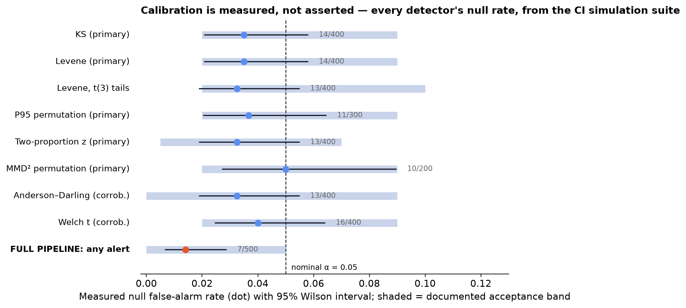
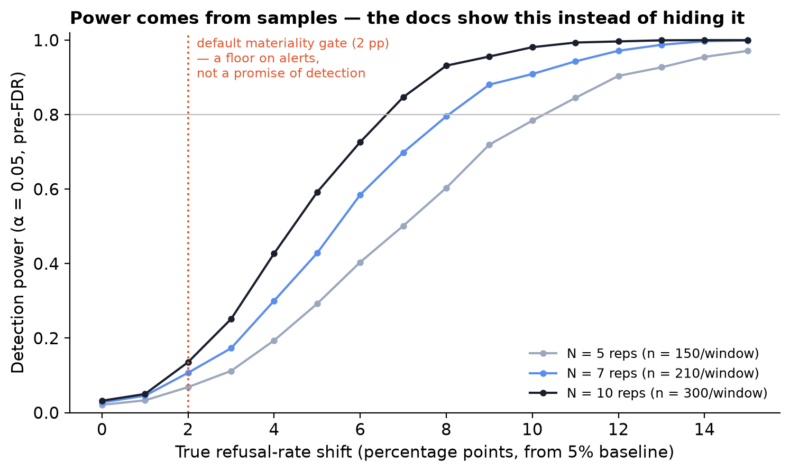

# The statistics

This page is the reason dedrift exists. Every claim below is enforced by a
test in CI; where a guarantee is approximate or a procedure is heuristic, the
docs say so plainly.

## The detector battery

One **primary** test per channel enters the FDR pool and can alert;
redundant tests run as **corroboration** only, so multiplicity is spent on
distinct questions rather than three answers to the same one.

| Channel | Primary test | Materiality gate | Corroboration |
|---|---|---|---|
| Location / shape | Two-sample Kolmogorov–Smirnov | KS statistic D ≥ 0.15 (sup-norm CDF distance — catches shape changes with equal means, where Cohen's d ≈ 0). **D is also the reported effect** for this channel, so what gates is what you read; Cohen's d appears on the Welch corroboration row as a location diagnostic | Anderson–Darling, Welch's t (raw p shown, never alert) |
| Dispersion | Brown–Forsythe (Levene, median-centered) | Robust dispersion ratio (mean abs deviation from the median) ≥ 1.5× either way | — |
| Tail | P95 permutation test (pooled labels, seeded, add-one p) | Relative P95 shift ≥ 10% | — |
| Rates | Two-proportion z, continuity-corrected | Percentage-point thresholds (refusal ≥ 2 pp, …) | — |
| Semantic | MMD² (RBF), seeded permutation null ≥ 500 perms, **pooled** median-heuristic bandwidth (permutation-invariant, so the kernel is fixed across relabellings) | Auto-calibrated MMD² floor, same bandwidth as the observation | — |
| Sequential per-cycle means | Page–Hinkley | Flag + onset localizer, not a p-value | — |
| Industry heuristic | PSI, 10 bins frozen from golden | Labeled heuristic (0.1 / 0.25); **never** a test; emitted only above its validity scale (see fine print) | — |

## The gating pipeline — order matters

1. Run all tests; collect p-values. PSI and Page–Hinkley produce flags, not
   p-values, and never enter step 2. Corroboration tests never enter it
   either.
2. **Benjamini–Hochberg FDR at q = 0.05** across the primary tests in the
   check — one multiplicity family spanning both baselines.
3. Survivors pass a **materiality gate** (per-channel thresholds in the
   table above) — all configurable. Corroboration tests carry no
   materiality verdict at all: the gates are defined on the primary effect
   scales, and e.g. the Anderson–Darling statistic is not commensurable
   with a sup-norm distance, so labeling it "material" would be
   meaningless.
4. Only primary tests passing **both** gates become alerts. Everything else
   appears in the report as "significant, below materiality", "not
   significant", or "corroboration".

Alert fatigue kills monitoring tools; the double gate is deliberate.

## Calibration is enforced, not asserted

The simulation harness generates agent logs with known ground truth, and CI
runs (on every commit and inside the release pipeline):

- **Per-detector null calibration** — every p-valued detector in the battery
  (KS, AD, Welch, Levene — including under heavy t(3) tails — the P95
  permutation test, the two-proportion z, and MMD) has its false-alarm rate
  measured over hundreds of null simulations against a stated acceptance
  band.
- **Pipeline-level null calibration** — 500 seeded stable-agent runs through
  the full pipeline; the per-check probability of any alert must have a
  Wilson 95% upper bound below 0.05. (A pass/fail over 20 runs — the
  original spec — would pass 39% of the time even with a true 10% alert
  rate; 500 runs with a reported bound is the honest version of the claim.)
  Scale caveat: these runs use 12 canaries × 5 repetitions, not the 18 × 7
  default, for CI runtime. Under a calibrated null the alert rate is
  approximately scale-free, but the materiality gates interact with N — so
  the bound is established, and claimed, at that stated scale.
- **Power checks** — injected shifts (mean, variance, distribution swap,
  equal-mean shape change, scripted model swap) must be detected at
  documented rates, with correct config attribution.

## Detection power: the honest table

Power comes from samples, and canary suites are small. For a rate signature
at a 5% baseline in a family of 30 canaries (two-sided α = 0.05 per test,
*before* FDR, which reduces power further):

| Repetitions N | n per window | +2 pp | +5 pp | +10 pp | +15 pp |
|---|---|---|---|---|---|
| 5 | 150 | 0.07 | 0.28 | 0.78 | 0.97 |
| 7 (default) | 210 | 0.11 | 0.42 | 0.91 | 1.00 |
| 10 | 300 | 0.13 | 0.60 | 0.99 | 1.00 |

**A 2 pp refusal shift is essentially undetectable at this scale.** The
default 2 pp materiality gate is a floor on what may alert, not a promise of
what will be detected. If small shifts matter, grow the relevant canary
family or raise N.

## Fine print, stated plainly

- **Balance is checked; exchangeability is measured, not assumed.**
  Balanced windows give equal *composition*. Exchangeability needs more:
  the per-record law must be constant across cycles, which is strictly
  stronger than "nothing in the configured stack changed". A hosted model
  varies within a fixed version alias, and the reference pools five cycles
  against a current window of one, so a shared per-cycle offset shows up as
  location and dispersion movement no two-sample test can distinguish from
  drift. Measured, on stable agents (100 runs per level):

  | shared per-cycle offset σ | runs alerting | Wilson 95% upper |
  |---|---|---|
  | 0.00 | 2/100 | 0.070 |
  | 0.10 | 23/100 | 0.322 |
  | 0.25 | 68/100 | 0.763 |

  A ~10% inter-cycle swing takes the alert rate from 2% to 23%. The 8/500
  headline is measured at σ = 0 and describes that regime only. If your
  provider is noisy between cycles, prefer `--inference anytime`, which is
  much less affected (0/100 up to σ = 0.20 at matched scope), and read
  [anytime-valid mode](anytime.md) for what that costs. The structural fix
  — a two-level design treating cycle as a random effect — is open work.

  The composition check remains: Every check
  verifies this per (baseline, family): if a canary's records vanish from
  one window (a timeout, a partial run, a suite edit), the family mixture
  shifts and KS would fire on a missing-data artifact — so the comparison
  is **suppressed and reported as COMPOSITION MISMATCH** instead of drift.
  Power against shifts confined to a few canaries remains lower than for
  family-wide shifts.
- **The guarantee on this page is per check, not per lifetime.**
  Everything above bounds the probability that *one* check on a stable
  agent raises an alert. Monitoring runs continuously, and expected
  counts add regardless of how checks depend on each other (linearity of
  expectation; only the "at least one" probability needs independence).
  At the measured 1.6% per-check rate, a stable agent checked hourly
  accrues roughly **0.3 false alerts per day, ~10 per month** (720 ×
  0.014). Benjamini–Hochberg controls the false discovery rate *within* a
  check; nothing in the batch machinery controls accumulation *across* a
  sequence of them.

    **Sequential control now exists**: [anytime-valid mode](anytime.md)
    replaces the per-check statement with a lifetime one — measured 0 false
    alerts in 500 stable-agent runs of 2000 cycles each, flat in the
    horizon, against 100% for this path on identical histories. It is not
    the default, because it buys that guarantee with detection power: a
    +2 pp shift becomes undetectable and +10 pp takes a median of 53
    cycles. Both figures are on that page. If you stay on the fixed-sample
    path, the honest operating advice is unchanged — treat one alert as
    evidence to investigate rather than an incident, require persistence
    across consecutive cycles before paging anyone, and choose your check
    frequency knowing the arithmetic above.
- **Where the KS gate binds.** The two-sample critical value at raw
  α = 0.05 is D_crit ≈ 1.36·√((n+m)/(n·m)). For equal arms the default
  gate (D ≥ 0.15) sits below D_crit until n ≳ 165 per arm — and BH only
  raises the bar. At typical per-family scale (say 21 current vs 105
  pooled reference, D_crit ≈ 0.32) significance is therefore the stricter
  filter, and the KS gate cannot be the one that fires; its job is to stop
  trivially significant D from alerting at large n. A config-aware test
  recomputes both claims from the shipped default, so a threshold change
  that breaks this description fails CI.
- **The flag channel (Page–Hinkley, PSI) is uncalibrated and carries no
  multiplicity control — treat flags as diagnostics, never as alerts.**
  PH runs on every (family, signature) stream (42 at the measured scale: 7 scalar signatures x 6 families), so
  per-stream rates compound: measured on the same 500 null runs as the
  headline bound, **68.6% of stable checks showed at least one flag** (up from 56% once Page-Hinkley stopped standardising itself with data from after the point it was judging). That
  number is printed here deliberately — flags never alert, they exist to
  localize onsets for attribution, and the report labels them as such.
  Cross-stream correction for the flag channel is on the roadmap.
- **PSI is refused where it cannot mean anything.** PSI between two finite
  samples of the *same* distribution is not zero — to first order
  E[PSI] ≈ (B−1)·(1/n_ref + 1/n_cur) — and that asymptotic figure is itself optimistic: simulating the shipped implementation at (30, 10) gives a measured E[PSI] of **3.10**, with PSI calling unchanged data a "major shift" **100%** of the time. At canary scale (10 bins,
  tens of records) exceeds the 0.25 "major" folk threshold from sampling
  noise alone; before this guard, PSI flagged **100% of stable checks**.
  The pipeline therefore emits PSI only when its null expectation is below
  half the "moderate" threshold (roughly n ≳ 360 equal-arm samples). PSI
  remains what it always was — a large-sample production-traffic index —
  and simply does not pretend to work below its domain of validity.
- **Anderson–Darling and Welch are corroboration, not evidence.** They test
  the same location/shape hypothesis as KS on the same data; admitting them
  to the FDR pool would roughly double m — halving every BH threshold — for
  no informational gain. Their raw p-values are printed for context and can
  never alert. (AD's p is additionally capped by SciPy's asymptotics to
  [0.001, 0.25].)
- **BH is used without a PRDS claim.** This page previously said PRDS was
  "believed to cover" positively correlated two-sided tests. That belief is
  no longer available: Dobriban (2026, arXiv:2607.12208) constructs
  correlated two-sided Gaussian p-values for which BH provably exceeds its
  nominal level, disproving a twenty-year-old conjecture. Our primaries are
  two-sided and computed on shared data — the exact configuration. The
  pipeline-level measured alert rate is therefore the operative guarantee
  for the default path; Benjamini–Yekutieli is on the roadmap for users who
  want a theorem, and `--inference anytime` uses e-BH, which holds under
  arbitrary dependence.
- **Page–Hinkley** (λ = 12, δ = 0.3 in robust-scale units, centre and scale
  estimated **causally** from an expanding window of data strictly before
  each step): the idealized null crossing bound is ~0.15% per stream, but
  because centre and scale are estimated from few observations the measured
  rate is **8.5% per stream on 30-cycle histories and 11.3% on 60-cycle
  ones** (8000 draws). An earlier version of this page said 1.5%; that came
  from an estimator that used the whole stream, including cycles *after* the
  alarm — a sequential detector reading its own future. Removing the
  look-ahead raised the honest rate sixfold. This is why PH is a labelled
  diagnostic that can never alert. The
PH alarms localize onsets for attribution;
  they only alert through the same materiality gating as batch tests.
- **MMD² materiality floor** is auto-calibrated per (baseline, family) as the
  95th percentile of MMD² between pairs of the baseline's own cycles — an
  empirical null from known-same-distribution data. With fewer than three
  reference cycles the floor is uncalibratable (0), and the config accepts an
  explicit override.
- **Reproducibility.** All randomness is seeded; permutation seeds are
  recorded in the report. Same logs + same config ⇒ the same report up to
  the recorded check timestamp: every statistic, p-value, effect, flag,
  and verdict is byte-identical; the timestamp line is the sole
  run-dependent field.
